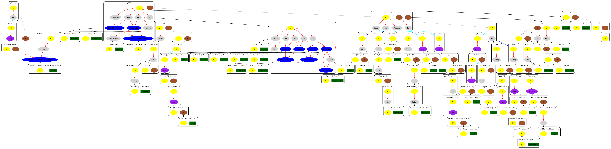

# Intro
You need zig 0.12 compiler and that's all

# Running
`zig build run`

# About
Most advanced engine for searching declarations by its types and composing expressions.

# How to run
1. Checkout `main.zig`, by default it use `demoServer` function to build tree using server and client connectin.
File `graph.png` contains visualisation of tree. Declarations on which the tree is built contains in `client.zig`.
Main algorithms in `tree.zig`, `Node.zig`, `TypeNode.zig` and `subtyping.zig`. 
2. Running tests with `zig build test`.
3. `main` function has other useful functions.

# Performance
TODO: update info

# How it works
It build prefix-tree like structure with subtyping graphs in Nodes.

# Contacts
Any questions, ask me tg: @De_Gradantos